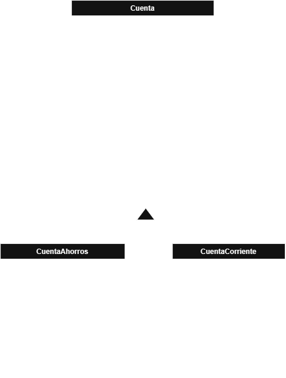

# Cuenta Bancaria
 Proyecto de fundamentos de Java


<p align="center">

[](https://www.oracle.com/java/)
[](https://maven.apache.org/)
[](https://junit.org/junit5/)
[](https://checkstyle.org/)
[](https://www.jacoco.org/)
[](https://git-scm.com/)

</p>

---


## Descripción

**Cuenta Bancaria** es un proyecto desarrollado en Java para practicar los fundamentos del lenguaje.

El proyecto simula diferentes tipos de cuentas bancarias y permite trabajar con operaciones como:

- Consignaciones.
- Retiros.
- Cálculo de intereses.
- Extractos mensuales.
- Comisiones.
- Sobregiros.
- Control del estado de una cuenta.

La aplicación está formada por una clase base, `Cuenta`, y dos clases hijas:

- `CuentaAhorros`
- `CuentaCorriente`

El desarrollo se realizó de forma progresiva, implementando primero la clase base y posteriormente las funcionalidades específicas de cada tipo de cuenta.

---

## Objetivos

Los principales objetivos del proyecto son:

- Practicar los fundamentos de Java.
- Trabajar con clases y objetos.
- Utilizar constructores.
- Trabajar con atributos y métodos.
- Comprender la herencia.
- Practicar la sobrescritura de métodos.
- Utilizar `super` para reutilizar métodos de la clase padre.
- Crear pruebas unitarias con JUnit 5.
- Gestionar el proyecto mediante Maven.
- Aplicar reglas de calidad mediante Checkstyle.
- Analizar la cobertura de las pruebas mediante JaCoCo.
- Utilizar Git para el control de versiones.

---

## Tecnologías utilizadas

| Tecnología | Uso |
|---|---|
| Java 21 | Lenguaje principal |
| Maven | Gestión y ejecución del proyecto |
| JUnit 5 | Pruebas unitarias |
| Checkstyle | Comprobación de estilo y calidad |
| JaCoCo | Análisis de cobertura |
| Git | Control de versiones |
| GitHub | Repositorio remoto |

---

## Estructura del proyecto

```text
cuenta-bancaria/
├── checkstyle/
│   └── checkstyle.xml
├── src/
│   ├── main/
│   │   └── java/
│   │       └── com/
│   │           └── ruddy/
│   │               └── cuentabancaria/
│   │                   ├── Cuenta.java
│   │                   ├── CuentaAhorros.java
│   │                   └── CuentaCorriente.java
│   └── test/
│       └── java/
│           └── com/
│               └── ruddy/
│                   └── cuentabancaria/
│                       ├── CuentaTest.java
│                       ├── CuentaAhorrosTest.java
│                       └── CuentaCorrienteTest.java
├── docs/
|    └── cuentabancaria.drawio.png
├── pom.xml
└── README.md
```

---

## Diagrama de clases

La estructura principal del proyecto utiliza una relación de herencia entre la clase `Cuenta` y sus dos clases hijas:

```text
                 Cuenta
                /      \
               /        \
      CuentaAhorros   CuentaCorriente

```
## Clase `Cuenta`

`Cuenta` es la clase base del proyecto.

Contiene el comportamiento común de los diferentes tipos de cuentas bancarias.

## Atributos

| Atributo | Tipo | Descripción |
|---|---|---|
| `saldo` | `float` | Saldo actual de la cuenta |
| `numeroConsignaciones` | `int` | Número de consignaciones realizadas |
| `numeroRetiros` | `int` | Número de retiros realizados |
| `tasaAnual` | `float` | Tasa de interés anual |
| `comisionMensual` | `float` | Comisión mensual |

## Constructor

El constructor recibe:

- Saldo inicial.
- Tasa anual.

```java
public Cuenta(float saldo, float tasaAnual)
```


## Clase `CuentaCorriente` y `CuentaAhorros`

Ambas heredan de `Cuenta`.

```java
public class CuentaCorriente extends Cuenta
public class CuentaAhorros extends Cuenta

```

### Diagrama



## Resultado final

La ejecución final de Maven terminó correctamente.

```text
Tests run: 18
Failures: 0
Errors: 0
Skipped: 0

BUILD SUCCESS
```

---


#### Uso de `super`
Se utiliza `super` para invocar el constructor de la clase padre y establecer los valores iniciales de los atributos.

```java
super.consignar(cantidad);
super.retirar(cantidad);
super.extractoMensual();

```
#### Constructores
Permiten inicializar los objetos con el saldo y la tasa anual.
Las clases hijas utilizan `super` para invocar el constructor de la clase padre:

```java
super(saldo, tasaAnual);
```
#### Testing
EL proyecto utiliza JUnit 5 para realizar pruebas unitarias de la clase `Cuenta` y sus métodos.
Se crearon tres clases de prueba:


- CuentaTest
- CuentaAhorrosTest
- CuentaCorrienteTest

### Checkstyle
Se utiliza Checkstyle para garantizar la calidad del código y cumplir con las reglas de estilo establecidas.
Durante el desarrollo, se corrigieron diferentes incidencias relacionadas con:
- Javadoc
- Orden de imports
- Numeros mágicos
- Formato de codigo
- Finalización de archivos
- Reglas de estilo

#### Maven
El proyecto utiliza Maven para gestionar la compilación y ejecución de las pruebas.

El comando utilizado fue:

```bash
mvn test
```